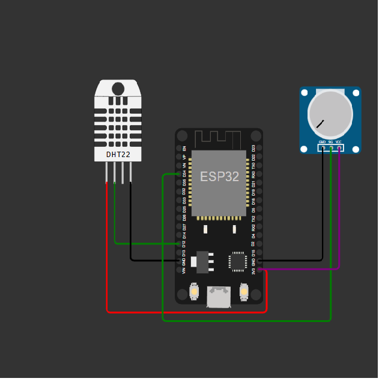
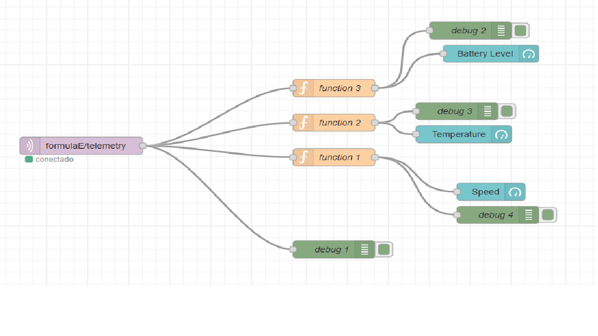

# Projeto de Telemetria IoT com ESP32

Este projeto utiliza o microcontrolador ESP32 para coletar e transmitir dados de sensores (temperatura, velocidade e nível de bateria) via MQTT. A interface de comunicação utiliza um broker MQTT, com visualização de dados através do Node-RED.

## Objetivo
O objetivo do projeto é coletar dados de telemetria de um "carro de corrida" simulado, utilizando o ESP32, um sensor de temperatura/humidade DHT22 e um potenciômetro para simular a velocidade do veículo. Os dados são enviados via protocolo MQTT e visualizados em um dashboard no Node-RED.

## Arquitetura
### Componentes 
    ESP32
    Sensor DHT22 (Temperatura)
    Potenciômetro (Simulação de Velocidade)

### Back-end (MQTT Broker)
    Utiliza o broker público da HiveMQ no endereço mqtt-dashboard.com e porta 1883.

### Front-end (Node-RED)
    Coleta os dados publicados no tópico MQTT e exibe informações sobre a temperatura,  umidade, velocidade e nível de bateria.
    

## Recursos Necessários
### Hardware:
1x ESP32

1x Sensor de Temperatura e Umidade DHT22

1x Potenciômetro

Jumpers e Protoboard para conexão

### Software
Arduino IDE com suporte ao ESP32

Bibliotecas:
WiFi.h (Conexão Wi-Fi)

PubSubClient.h (Protocolo MQTT)

DHTesp.h (Leitura de sensor DHT22)

Broker MQTT (HiveMQ)

Node-RED para visualização dos dados

## Instruções de Uso 
### Configuração do Projeto
#### Instale as bibliotecas necessárias via Arduino IDE.
    Vá em Sketch > Incluir Biblioteca > Gerenciar Bibliotecas.
    Pesquise e instale as bibliotecas mencionadas.

#### Configuração do Broker MQTT
    Utilize o broker MQTT público mqtt-dashboard.com com as seguintes configurações:
        Broker: mqtt-dashboard.com
        Porta: 1883
        Tópico: formulaE/telemetry

#### Configuração do Node-RED
        Instale o Node-RED e adicione um fluxo de MQTT para subscrever ao tópico formulaE/telemetry.
        Configure o dashboard com widgets para exibir os dados recebidos.
    
    ## Requisitos
    Conexão Wi-Fi: Certifique-se de que o ESP32 esteja conectado a uma rede Wi-Fi com acesso à internet.
    
    Broker MQTT: O broker utilizado no código é o mqtt-dashboard.com, que é um broker público para testes.
    
    Node-RED: Deve estar instalado e configurado para subscrever ao tópico correto.
    
    ## Codigo Fonte
    #include <WiFi.h>
    #include <PubSubClient.h>
    #include <DHTesp.h>  // Biblioteca para o sensor DHT22
    
    // Configurações do Wi-Fi
    const char* ssid = "Wokwi-GUEST";
    const char* passwordWiFi = "";
    
    // Configurações do MQTT (HiveMQ ou outro broker)
    const char* broker = "mqtt-dashboard.com";
    const int port = 1883;  // Porta padrão MQTT
    const char* clientId = "clientId-yti4dEeWBf";
    const char* mqttUser = "";  // Usuário MQTT (pode ser fictício)
    const char* mqttPassword = "";  // Senha MQTT (pode ser fictícia)
    const char* topic = "formulaE/telemetry";  // Tópico de telemetria
    
    // Pinagem dos sensores
    #define PIN_DHT 12  // Pino de dados do sensor DHT22
    #define PIN_POT 34  // Pino analógico do potenciômetro
    
    WiFiClient net;
    PubSubClient client(net);  // Corrigido para PubSubClient
    DHTesp dht;
    
    void connectWiFi() {
      Serial.print("Conectando ao WiFi...");
      WiFi.begin(ssid, passwordWiFi);
      while (WiFi.status() != WL_CONNECTED) {
        delay(1000);
        Serial.print(".");
      }
      Serial.println(" conectado!");
    }
    
    void connectMQTT() {
      Serial.print("Conectando ao MQTT...");
      while (!client.connected()) {
        if (client.connect(clientId, mqttUser, mqttPassword)) {
          Serial.println(" conectado ao broker MQTT!");
        } else {
          Serial.print(".");
          delay(1000);
        }
      }
    }
    
    void setup() {
      Serial.begin(115200);
    
      // Configurações iniciais
      connectWiFi();
      client.setServer(broker, port);  // Corrigido para setServer em vez de begin
      connectMQTT();
      
      // Configura o sensor de temperatura DHT22
      dht.setup(PIN_DHT, DHTesp::DHT22);
    
      // Pino do potenciômetro configurado como entrada
      pinMode(PIN_POT, INPUT);
    }
    
    void loop() {
      if (!client.connected()) {
        connectMQTT();
      }
      client.loop();
    
      // Leitura da temperatura e umidade do DHT22
      TempAndHumidity data = dht.getTempAndHumidity();
      
      // Verifica se a leitura do sensor DHT22 foi bem-sucedida
      if (isnan(data.temperature) || isnan(data.humidity)) {
        Serial.println("Erro ao ler o sensor DHT22!");
        return;  // Sai do loop se houver erro
      }
    
      // Mostra a temperatura e umidade no monitor serial
      float temperature = data.temperature;
      float humidity = data.humidity;
      Serial.print("Temperatura: ");
      Serial.println(temperature);
      Serial.print("Umidade: ");
      Serial.println(humidity);
    
      // Simular a velocidade do carro lendo o valor do potenciômetro (0 a 4095)
      int potValue = analogRead(PIN_POT);
      int speed = map(potValue, 0, 4095, 0, 250);  // Converte para velocidade de 0 a 250 km/h
      Serial.print("Velocidade: ");
      Serial.println(speed);
    
      // Simular o nível de bateria
      int batteryLevel = random(20, 100);
    
      // Criando o payload de telemetria em formato JSON
      String payload = "{";
      payload += "\"temperature\": " + String(temperature) + ",";
      payload += "\"humidity\": " + String(humidity) + ",";  // Adiciona a umidade ao payload
      payload += "\"speed\": " + String(speed) + ",";
      payload += "\"batteryLevel\": " + String(batteryLevel);
      payload += "}";
    
      Serial.println("Enviando dados de telemetria:");
      Serial.println(payload);
    
      // Publicando a telemetria no tópico MQTT com QoS 2
      if (client.publish(topic, payload.c_str(), 2)) {
        Serial.println("Dados enviados com sucesso!");
      } else {
        Serial.println("Falha ao enviar dados.");
      }
    
      delay(5000);  // Envia dados a cada 5 segundos
    }

## Fotos

## Link Projeto
[Link](https://wokwi.com/projects/409658145231135745)

## Autores

- Enzo Valieres(RM555119)
- Gilherme Barbiero (RM555185)
- Matheus Cantiere (RM558479)
- Pedro de Lorenzo (RM554720)
- Vinicius Castro

